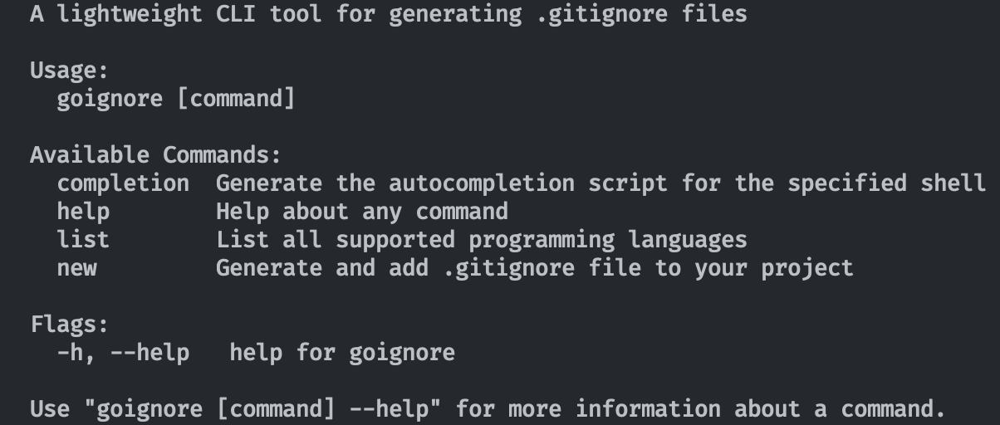

# goignore

`goignore` is a lightweight Command Line Interface (CLI) tool for generating `.gitignore` files based on the programming language you're using. It helps you easily create `.gitignore` files for your projects by either specifying a programming language or automatically detecting it from the files in your project directory.

<div align="center">

</div>

## Installation

To use `goignore`, you need to have Go (Golang) installed on your system. If you haven't installed Go, you can download and install it from the [official website](https://golang.org/doc/install).

Once you have Go installed, you can install `goignore` using the following command:

```sh
go install github.com/hacktivist123/goignore
```

## Usage
### Generating .gitignore File
To generate a .gitignore file for a specific programming language, you can use the following command:

```sh
goignore new --language=<language>
```

Replace <language> with the desired programming language. For example, to generate a .gitignore file for Python:

```sh
goignore new --language=python
```
You can also use the -l shorthand for the --language flag.

## Auto-Detecting Language
If you want goignore to automatically detect the programming language based on the files in your project directory, you can use the auto keyword:

```sh
goignore new --language=auto
```

## Listing Supported Languages
To list all supported programming languages for generating .gitignore files, you can use the following command:

```sh
goignore list
````
This will display a list of supported programming languages.

## Contributing
Contributions to goignore are welcome! If you encounter any issues, have suggestions, or want to contribute improvements, please open an issue or submit a pull request on the GitHub repository.

## License
This project is licensed under the MIT License.
